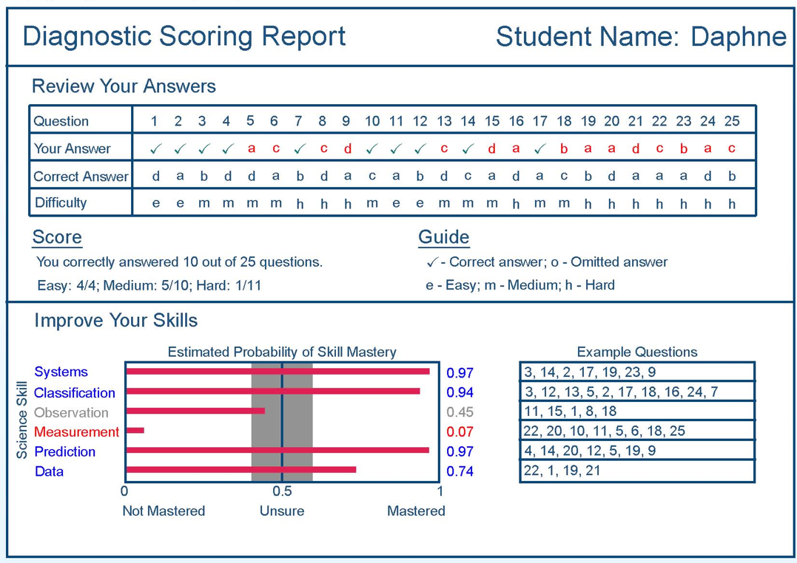
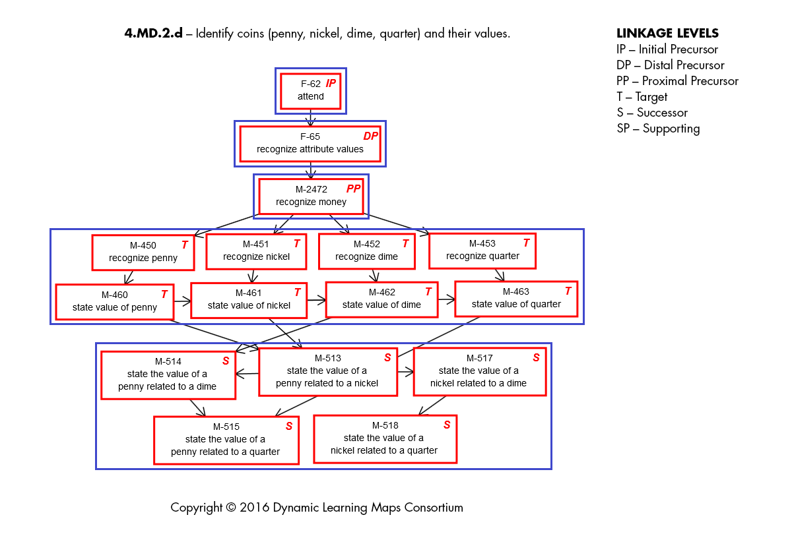

## My Philosophy
 

> - I'm a psychometrician who thinks our current system of assessment is bad for education
> - We test students far to much for what we get out of each test
>   - From PARCC: http://www.parcconline.org/assessments/administration/times 
> - Current system of testing for accountability seems unnecessary in light of recent policy and psychometric advances
> - For a test to be more useful, it must:
>   - Not consume large amounts of time for instruction (including test preparation!)
>   - Tell stakeholders more about the student
>   - Do so in a short amount of time (immediately, if possible)

--- .segue

# New Psychometric Methods

--- 

## Advances in Psychometrics

Recently, advances in psychometrics and statistics have enabled the practical use of more powerful psychometric methods:

> - Multidimensional models
>   - More information from tests
> - Modeling additional dependencies in tests (e.g., testlets and multilevel/hierarchical data)
>   - Better accuracy of scores/standard errors of scores
> - Generalized models (e.g., for items with new response formats)
>   - More types of items
> - Improved estimation methods (e.g., multiple types of Monte Carlo methods, hybrid Monte Carlo/optimization, limited information methods)
>   - Speeding calibration time and accuracy

--- 

## More Advances in Psychometrics

Recently, advances in psychometrics and statistics have enabled the practical use of more powerful psychometric methods:
> - Improved model fit methods (e.g., limited information model fit)
>   - Improving validity of test scores/standard errors of scores/reliability estimates
> - Models with different types of latent variables (e.g., nominal categories, ordinal categories)
>   - Demonstrating heterogeneity in data (Nominal)
>   - Enabling shorter test times (Ordinal)
>   - __Diagnostic Classification/Cognitive Diagnosis Models__

---

## Motivation for DCMs

> - Testing more today than ever before
  - Accountability
> - What are we getting out of testing?
    - Often, a single score per content area (e.g., Mathematics, etc...)
    - How useful is this score:
      - To make decisions about studetns?
      -  To reflect students' knowledge base or deficiences?
      - To inform instruction?
- What if a test didn't give a single score?
  - Instead made decisions about students
    - Multiple (discrete) facets of a content area

---

## Diagnostic Classification Model Names

DCMs have been called by many names:
- Cognitive diagnosis models
- Skills assessment models
- Cognitive psychometric models
- Latent response models
- Restricted (constrained) latent class models
- Multiple classification models
- Structured located latent class models
- Structured item response theory

--- 

## Diagnostic Modeling Concepts

Imagine that an elementary school teacher wants to evaluate his/her students' ability in basic mathematics

> - Using traditional psychometrics, the teacher could:
>   - Assign a score for the total number correct (Classical Test Theory)
>   - Assign a scaled score (Item Response Theory)
> - Scores place students in ordered along a continuum

--- 

## A Depiction of Traditional Psychometric Scores

--- 

## A Depiction of Traditional Psychometric Scores

--- 

## A Depiction of Traditional Psychometric Scores

--- 

## A Depiction of Traditional Psychometric Scores

--- 

## Traditional Psychometrics

> - What results is a (weak) ordering or students
  - Ordering is called "weak" because of error in estimates
  - Hillary > Gary > Donald
  
> - Questions traditional psychometrics cannot answer:
    - Why is Donald so low?
      - How can we best help him?
    - How much ability is "enough" to pass?
      - How much is enough to be proficient?
    - What math skills have the students mastered?

---

## Multiple Dimensions of Basic Mathematics

Alternatively, we could express basic mathematics ability as a set of four basic skills:
> - Addition
> - Subtraction
> - Multiplication
> - Division

---

## Ability from a Diagnostic Perspective

---

## Ability from a Diagnostic Perspective

---

## Ability from a Diagnostic Perspective

---

## Ability from a Diagnostic Perspective

---

## Multiple Dimensions of Ability

> - The set of skills represents the multiple dimensions of elementary mathematics ability
> - Other psychometric approaches have been developed for multiple dimensions
>   - Subscores (Classical Test Theory)
>   - Multidimensional Item Response Theory
> - Yet, issues have remained in their practical application:
>   - Reliability of estimates is often poor for practical test lengths
>   - Dimensions are often very highly correlated
>   - Large samples are needed to calibrate item parameters in MIRT

---

## Additionally: Learning Pathways

How would MIRT/Subscores handle if skills were learned in this order:

---

## DCMs as an Alternative

> - DCMs do not assign a single score
> - Instead, students are given a profile of mastered attributes
>   - Multidimensional models
> - DCMs provide such information with fewer data demands than other multidimensional models
>   - Higher reliability* than comperable IRT/MIRT models
>     - *Reliability for classification -- across entire test
>   - Complex item structures
> - *Reliability for classification -- across entire test

--- 

## Score Reliability Comparison

From: Templin and Bradshaw (2013; Journal of Classification)

--- 

## Path Diagram of Traditional Psychometrics

--- 

## Path Diagram of Diagnostic Models

--- 

## IRT Model Parameterization

For a person $p$ and an item $i$, the two-parameter logistic IRT model specifies:

$$P(X_{pi}=1|\theta_p) = \frac{\exp\left({a_i\left(\theta_p - b_i\right)}\right)}{1+\exp\left({a_i\left(\theta_p - b_i\right)}\right)} = \frac{\exp\left(\lambda_{i0} + \lambda_{i1} \theta_p \right)}{1+\exp\left(\lambda_{i0} + \lambda_{i1} \theta_p \right)}$$

Where:
- $\theta_p \sim N(0,1)$ is the person-specific latent variable (ability)
- $a_i$ is the item-specific discrimination parameter
- $b_i$ is the item-specific difficulty parameter
- $\lambda_{i0} = -a_ib_i$ is the item-specific intercept 
- $\lambda_{i1} = a_i$ is the item-specific slope

--- 

## Item Characteristic Curve

--- 

## DCM Model Parameterization (LCDM: One Attribute)

For a person $p$ and an item $i$, the loglinear cognitive diagnosis model specifies:

$$P(X_{pi}=1|\alpha_p) = \frac{\exp\left(\lambda_{i,0} + \lambda_{i,1,(1)} \alpha_p \right)}{1+\exp\left(\lambda_{i,0} + \lambda_{i,1,(1)} \alpha_p \right)}$$

Where:
- $\alpha_p \sim B(p_{\alpha})$ is the person-specific latent variable (mastery status; 0=non master 1=master) 
- $\lambda_{i,0}$ is the item-specific intercept 
- $\lambda_{i,1,(1)}$ is the item-specific main effect

--- 

## Item Characteristic Bar Chart (One Attribute)

--- 

## DCM Model Parameterization (LCDM: Two Attributes)

For a person $p$ and an item $i$, the loglinear cognitive diagnosis model specifies:

$$P(X_{pi}=1|\alpha_p) = \frac{\exp\left(\lambda_{i,0} + \lambda_{i,1,(1)} \alpha_{p1} + \lambda_{i,1,(2)} \alpha_{p2}+ \lambda_{i,2,(1,2)} \alpha_{p1}\alpha_{p2}\right)}{1+\exp\left(\lambda_{i,0} + \lambda_{i,1,(1)} \alpha_{p1} + \lambda_{i,1,(2)} \alpha_{p2}+ \lambda_{i,2,(1,2)} \alpha_{p1}\alpha_{p2}\right)}$$

Where:
- $\alpha_p \sim B(p_{\alpha})$ is the person-specific latent variable (mastery status; 0=non master 1=master) 
- $\lambda_{i,0}$ is the item-specific intercept 
- $\lambda_{i,1,(1)}$ is the item-specific main effect for $\alpha_{p1}$
- $\lambda_{i,1,(2)}$ is the item-specific main effect for $\alpha_{p2}$
- $\lambda_{i,2,(1,2)}$ is the item-specific interaction for $\alpha_{p1}$ and for $\alpha_{p2}$

--- 

## Item Characteristic Bar Chart (Two Attributes)

--- 
## Example of DCM Score Report

---

## DCM Conceptual Summary

> - DCMs focus on WHY a student is not performing well as compared to only focusing on WHO is not performing well
> - The psychometric models define the chances of a correct repsonse based on a student's profile of attribute mastery statuses
> - Many models have been created, ranging in complexity
>   - A general DCM: The Loglinear Cognitive Diagnosis Model
>   - The general model subsumes all other latent class-based DCMs
> - DCMs share a number of features with Bayesian Networks (e.g. Almond et al., 2015)
>   - The key difference is how the structural model (the attribute space) is defined

---

## Ramifications of Use of DCMs

> - Reliable measurement of multiple dimensions simultaneously
> - Shorter unidimensional tests

--- .segue

# Uses of DCMs in Operational Settings

---

## Current Operational Uses of DCMs

DCMs are used in two large scale operational testing environments

> 1. PARCC Formative Assessments
>   - Short unidimensional assessments
>   - Unidimensional feedback given
> 2. The Dynamic Learning Maps Alternate Assessment System: http://dynamiclearningmaps.org/
>   - Assessment consortium for alternate population
>   - Based on concept of learning maps
>   - Does not report at the skill level (collections of skills, but only for some states)

---

## Learning Maps

A learning map is:
- A collection of skills to be mastered along with 
- The connections between skills 

The map indicates the skills that must be mastered prior to learning any new skill

---

## Example Portion of the DLM Learning Map

From: http://dynamiclearningmaps.org

---

## DLM Implementation: The Missing Learning Map

Although the learning map idea behind DLM is very important, issues have remained in its implementation:

> - The size of the initial map was far too big to align (some 6,000+ latent variables)
> - The needs of the consortium necessitated two types of tests
>   - Integrated throughout the year
>   - Year end only
> - The population of students necessitates short tests
> - The states involved were unprepared for such a change in test results

--- .segue

# "Innovations" in Policy

---

## The Every Student Succeeds Act (ESSA)

The ESSA was signed into law by President Barack Obama on December 10, 2015. 

--- 

## ESSA

Notable portions of the law with respect to accountability:
> - States have flexibility in format of assessment
>   - Can include multiple interim assessments through the course of the academic year
> - Ability to pilot innovative approaches to statewide assessments (up to seven states)
>   - Multiple assessments (e.g., curriculum-embedded, interim, or through-course tests) given throughout the year
>   - May be based on a subset of grades/subjects
>   - Up to 8 years to implement statewide
> - The ESSA could be the means to better testing and instruction, but...

---

## A Plot Twist in the ESSA

A notable event happened last week:

It remains to be seen how the Trump Administration will handle the ESSA (and the US Dept. of Ed.)

--- .segue

# A Hypothetical Model for Assessment that Informs Instruction and Accountability

---

## Putting Psychometrics and Policy Together

What an Innovative Assessment Could Look Like:

- It could be learning map-based or informed
  - May not need the "map" portion

---

## Putting Psychometrics and Policy Together

--- 

## Multidimensional Assessment and Standards

- Each square is a latent variable 
  - Mastery status can be attained instead of scale score
  - All that matters: Student has learned material in each square

---

## Multidimensional Assessment and Standards

---

## Modularized Assessment

- Can assess each latent variable throughout school year
- Students who are masters of content can move on
- Students who need remediation can take earlier material

---

## Modularized Assessment

---

## Assessment Throughout Academic Year

- Students are assessed proximal to when content is learned in curriculum
- Later content depends on mastery of earlier content, all progress counts for accountability
- My argument: All tests are summative, only differentiable by grain size of latent variable

---

## Assessment Throughout Academic Year

---

## Tests Standardized Across State

Tests administered across state using common item bank for each latent variable

---

## Instant Results

Because each test is tied to curriculum, results must be instant:
- If a student is found to be a master: they move on
- If a student is not yet a master: they get remediation

---

## Results Used for Summative Accountability

Goal for students: Master as many concepts as possible
- Profile based standards can be accomplished
- Standard setting takes a different form

---

## Results Used for Summative Accountability

---

## Results Used for Growth

Growth is simple concept: 
- What do you know now that you did not know before?
- Understandable metrics that do not yield notable non-sense results

---

## Results Used for Growth

---

## Overall Benefit

Tests can be integrated into instruction and the curriculum
- No need for "testing windows" and exam preparation
- Teaching to the test means teaching the curriculum

---

## Is It Possible?

One key: Getting vendors to expand their menu

--- .segue

# For More Information on DCMs

---

## Notable Books

Rupp, Templin, & Henson (2010). Diagnostic measurement: Theory, Methods, and Applications. Guilford.

Almond, Mislevy, Steinberg, Yan, & Williamson (2015). Bayesian Networks in Educational Assessment. Springer.

---

## Workshops

One Day Workshops at the National Council on Measurement in Education:
- BayesNets (Almond); Typically offered each year
- DCMs (Bradshaw and Madison for 2017); Typically offered each year

Four Day Workshop: May 2017
- Instructor: Yours Truely
- Location: Hilton Head Island, South Carolina
- http://www.StatsOnTheBeach.com

---

## Thank you!

Questions? Comments? Complaints?

- Email: jtemplin@ku.edu
- Twitter: @jltemplin
- Talk slides available at: http://jonathantemplin.com/files/presentations/fera2016

