## My Background

> - Professor at the University of Kansas, Department of Educational Psychology
>   - Research, Evaluation, Measurement, and Statistics Program
> - Research foci:
>   - Multidimensional psychometric methods
>   - Applications of Bayesian statistics
> - Also known for:
>   - Cognitive Diagnosis/Diagnostic Classification Models

---

## My Philosophy

> - I'm a psychometrician who thinks our current system of assessment for accountabilty is <b>bad</b> for education
> - We test students far too much relative to what we get out of each test
>   - From Smarter Balanced: https://portal.smarterbalanced.org/library/en/estimated-testing-times.pdf
> - Current system of testing for accountability is unnecessary in light of recent policy and psychometric advances
> - For a test to be more useful, it must:
>   - Not consume large amounts of time for instruction (including test preparation!)
>   - Tell stakeholders more about the student
>   - Do so in a short amount of time (immediately, if possible)
> - But...building assessments that provide more information is very difficult in practice

---

## Defining Terms I Will Use Today

>- Trait/Skill/Attribute/Ability (ahem...Dimensions): 
>  - Scores are numeric representations of traits
>- Assessment/test: A collection of tasks used to quantify scores
>- Item: A generic term for an assessment task
>- Person/student/examinee/respondent: The person taking the assessment
>- Psychometric Models/Methods: The mathematical linkage between the student performance and their score(s)

--- .segue

# Dimensionality

---

## Ok Google: Define Dimension

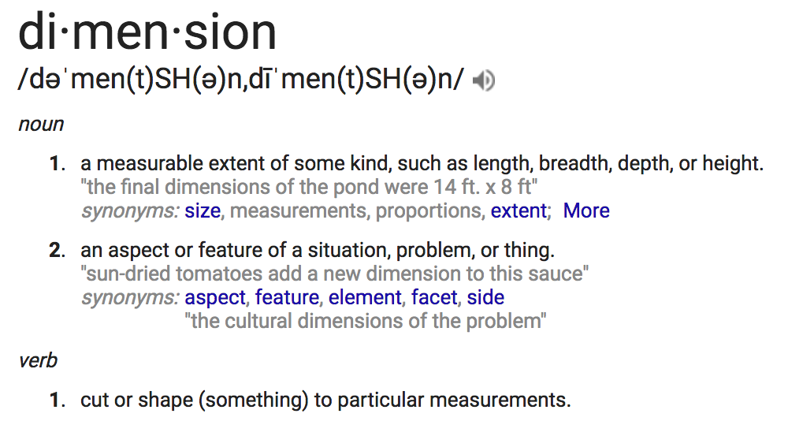

---

## Dictionary Definition, Continued

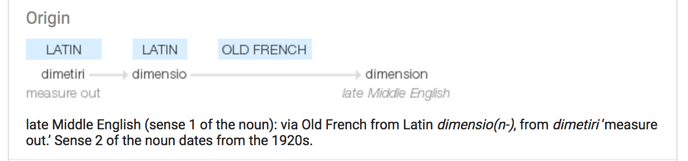

---

## Dimensionality in Educational Testing

- The dimensions of interest in educational testing are represented by the scores of a test

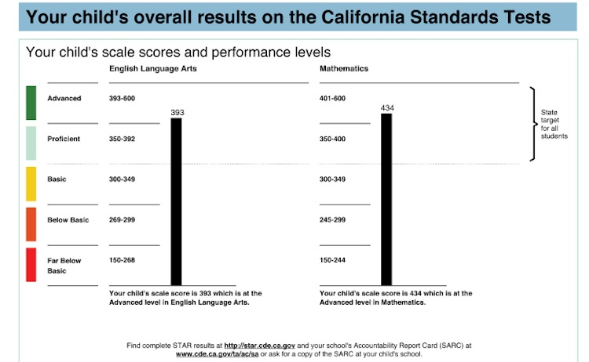

  Image source: <a href="https://edsource.org/wp-content/uploads/2015/03/CST-Report-levels031015.jpg">
 https://edsource.org/wp-content/uploads/2015/03/CST-Report-levels031015.jpg
  </a>

---

## On Test Scores

> - Once given, test scores often are treated as having charactaristics similar to that of physical measurements, like length/height:
>   - Assumed to be precise
>   - Assumed to be an accurate representation of the label for the score ("Math" means overall mathematics ability)
> - But, test scores and precise physical measurements are seldom the same...
>   - Scores have error (sometimes a lot of error) -- indexed by reliablity or standard error of measurement
>   - The meaning of the score may not be accurate
>   - Scores have no true zero point

---

## On Error in (Simple) Physical Measurements

> - To measure the height of an object, a ruler or tape measure can be used
>  - Small amounts of error are often present either in the ruler (systematic) or in the observer (random)
>  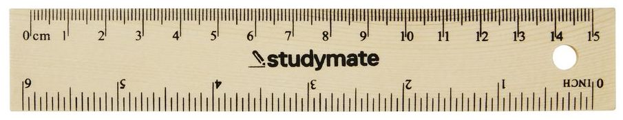

---

## On Error in Test Scores

> - If we could make an analogy of height and test scores, then the ruler would be different
> - Rather than using one very precise and consistent ruler, we would have to use a set of smaller and more inconsistent measures
>  - Think of a set of smaller rulers, each approximately one inch in length...but some are larger than an inch and some are smaller than an inch
>  - These small rulers are like the items of a test &mdash; each contributes some information to the score, but also each has error
> - The overall length measure might then have a lot of error...
> - Often, the amount of error in a score depends on the location of the score itself (harder to measure those at the ceiling/floor)

---

## Test Scores with Error

Sometimes there is a little error in scores...

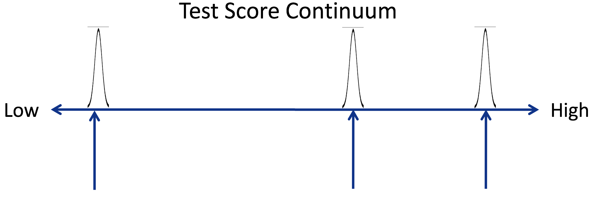

---

## Test Scores with Error

Sometimes there is a lot of error in scores...

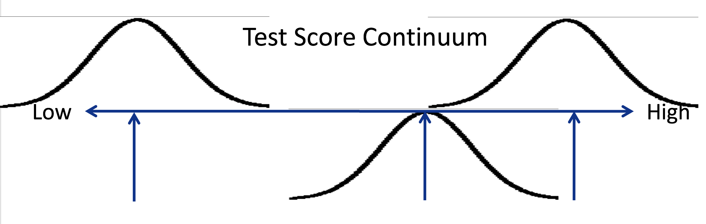

---

## Scores are Summaries of Distributions

---

## There Is No Score

---

## Scores vs. Cut Points

Mistaking this:

For this:

  Image source: <a href="http://www.ksassessments.org/scorereports">
 http://www.ksassessments.org/scorereports
  </a>

---

## An Example from the GRE

Data from https://www.ets.org/s/gre/pdf/2010-11_gre_guide.pdf

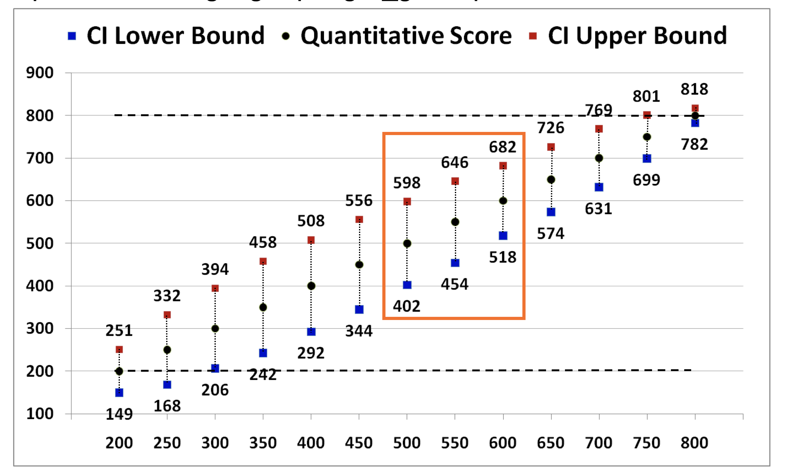

  Image source: Lesa Hoffman, 948, Lecture 1 <a href="http://www.lesahoffman.com/CLP948/index.html">
 http://www.lesahoffman.com/CLP948/index.html
  </a>

---

## More from the GRE

If scores have error, where is that noted on the score report?

Recall Linn (2000, p. 15): "Recognize, evaluate, and report the degree of uncertainty in the reported results."

--- 

## On the Meaning of the Score

What the score represents is dependent upon the items of the test

> - Unlike many physical measurements, few educational constructs are easily defined
> - For instance, take mathematics
>  - In accountability testing, often one math score per assessed grade is given
>  - What contributes to that score? (Test blueprint and specifications)
>  - Are scores comparable across grades? Across years? Across states?
> - Should there be more than one score?

---

## We Often Create Our Reality

> - Building assessments involves trial and error
> - Sometimes, test items do not fit the psychometric model used for assessment
> - Often, the poorly fitting items are omitted from a test
>   - The test then takes the form of the items that are left
> - Many times this is forgotten as traits become living things

---

## Reality Bites Back

Scores from the same person are often correlated
> - Sometimes, that correlation is so high that the scores are indistinguishable
> - In such cases, correlated scores really are not distinct
> - Traits must have a basis in reality
>   - To narrow of definition is just as problematic as to wide

---

## Section Summary

> - Dimensions are the scores given from tests
> - Test scores aren't like physical measurements
> - Scores often contain error (how much depends on the score itself)
> - Scores represent our attempt to put numbers on unobservable traits

--- .segue

# Common Assessment Specs

--- 

## Common Assessment Specifications

>- Most large-scale tests are scored using a unidimensional psychometric model
>- Unidimensional: One trait thought to underlie the items
>- One (main) score given to examinees
> 

 
 

 

  Image source: <a href="http://www.parcconline.org/assessments/score-results/2016-score-reports"> 
  http://www.parcconline.org/assessments/score-results/2016-score-reports
  </a>

>- Sometimes more information is given...we will return to this shortly

---

## Assessment Specification Diagram

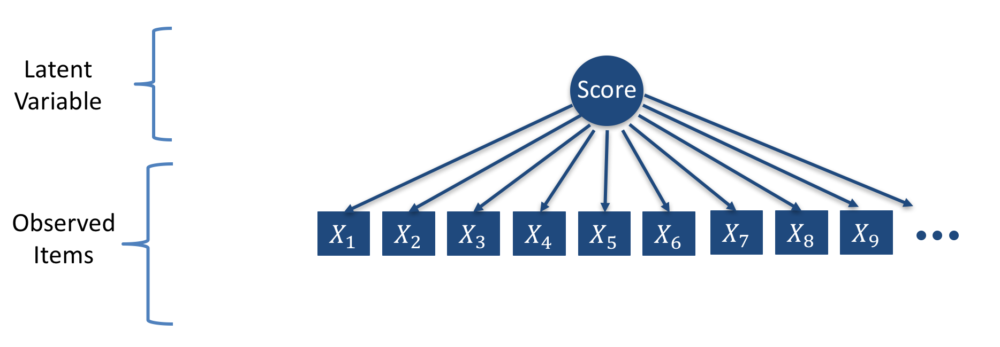

---

## Definitional Specificity of a Trait

>- The definitional specificity of a trait is referred to as the grain size
>  - Driven by the level of specificity with which one desires to make inferences about students on the basis of their test score(s)
>  - What you want to know about a student
>- In current summative testing, the grain size is often very coarse
>  - 4th Grade Math
>  - 7th Grade English Language Arts
>- So, if more detailed information is needed, a more specific definition is needed:
>  - A math example: <a href="https://turnonccmath.net/"> https://turnonccmath.net/ </a>

---

## But Not All Tests Can Be Unidimensional

As constructs and standards become more detailed, it becomes harder to create items that align well to one dimension
 

 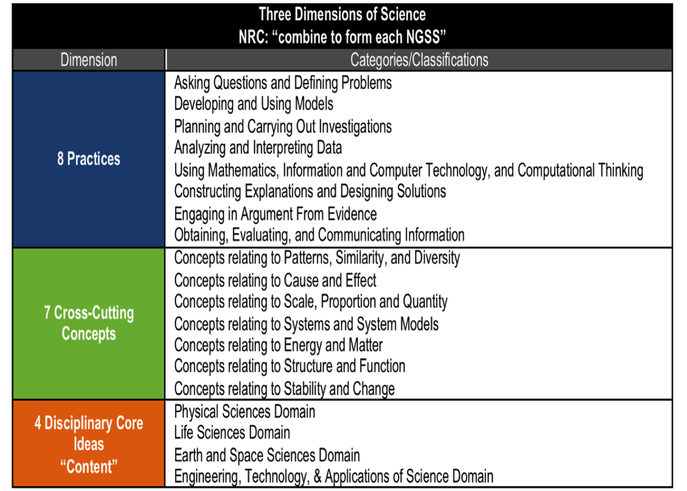
 

 

  Image source: <a href="http://www.p2learninggroup.com/next-generation-science-standards.html"> 
  http://www.p2learninggroup.com/next-generation-science-standards.html
  </a>

---

## Arguments about Dimensionality

---

## Two vs. Three Dimensions of Earth

---

## Dimensionality in Politics 

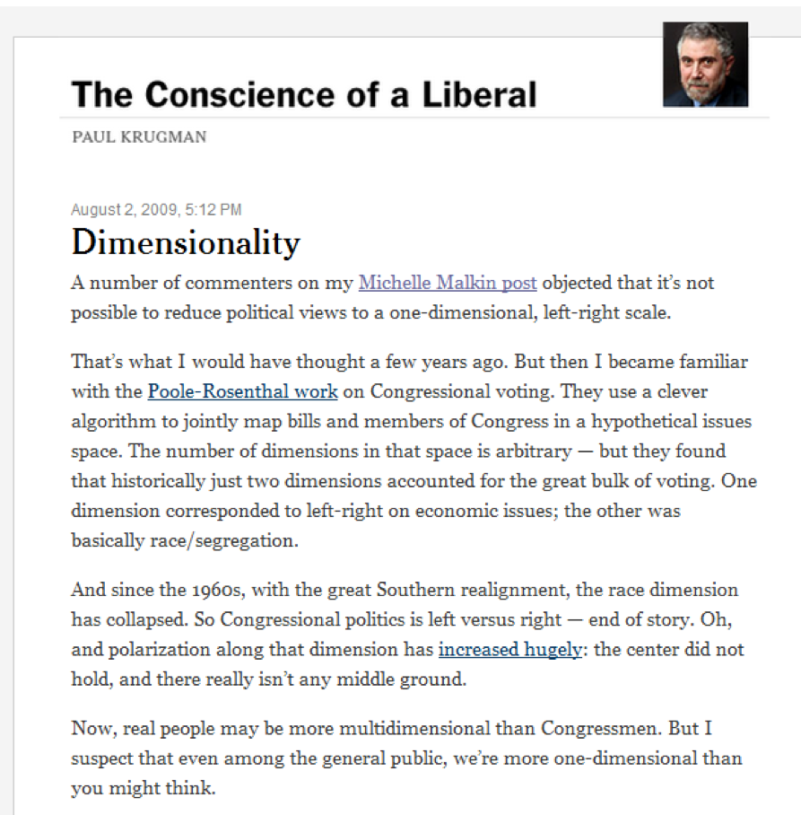

---

## Dimensionality in Education

> - Dimensionality is number of traits assessed by a test
> - The utility of the outcome is key to the usefulness of a test
> - For learning and growth, unidimensional tests are generally at too abstract of a level to present actionable evidence to help students
> - For too long we have tailored our tests to fit existing psychometric models, or mainly, software choices
> - The field has advanced to a state where this is no longer necessary

> - Recall Linn (2000, p. 15): "Don't put all of the weight on a single test. Instead, seek multiple indicators. The choice of construct matters and the use of multiple indicators increases the validity of inferences based upon observed gains in achievement." 

--- 

## Section Summary

>- Traits (and the scores that represent them) are made by definition (grain size)
>- Most large-scale tests assess one trait, providing one score
>- As definitional grain size narrows, more traits (and scores) are needed to describe behavior
>- Additional scores can be good things!

--- .segue

# Why Assess Multiple Dimensions?

---

## Motivations for Multiple Dimensions

<video controls class="center">
  <source src="assets/img/media1.mp4" type="video/mp4">
  Your browser does not support the video tag.
</video>

---

## Motivations for Multiple Dimensions

>- Additional information needed about student abilities 
>- Nature of some items necessitates multiple dimensions
>- Constructs/standards are inherently multidimensional
>- Key questions:
>   - What dimension(s) do you want to measure?
>   - Are the dimension(s) separable?
>   - What gets in the way of measuring those dimension(s)?

---

## Additional Information Needed

Additional information needed about student abilities (i.e., definition "grain size")

 

 
 

 

  Image source: <a href="https://www.slideshare.net/MarciShepard/common-core-state-standards-math-workgroup-training"> 
  https://www.slideshare.net/MarciShepard/common-core-state-standards-math-workgroup-training
  </a>

--- 

## Item Features are Multidimensional

# Nature of some items necessitates multiple dimensions (e.g. testlets)

- Example from PARCC practice test for ELA: <a href="https://parcc.pearson.com/practice-tests/english/"> https://parcc.pearson.com/practice-tests/english/</a>

__Technical details__:

Typical IRT Model

$$P\left(Y_{pi} = 1 \middle| \theta_p \right) = \frac{\exp\left(\theta_p - b_i \right)}{1 + \exp\left(\theta_p - b_i \right)}$$

Basic Testlet IRT Model

$$P\left(Y_{pi} = 1 \middle| \theta_p, \gamma_p \right) = \frac{\exp\left(\theta_p - b_i + \gamma_p \right)}{1 + \exp\left(\theta_p - b_i + \gamma_p \right)}$$

--- &nologo

## Item Content is Multidimensional

# Consider the Math Item from the PARCC Practice Test

 

 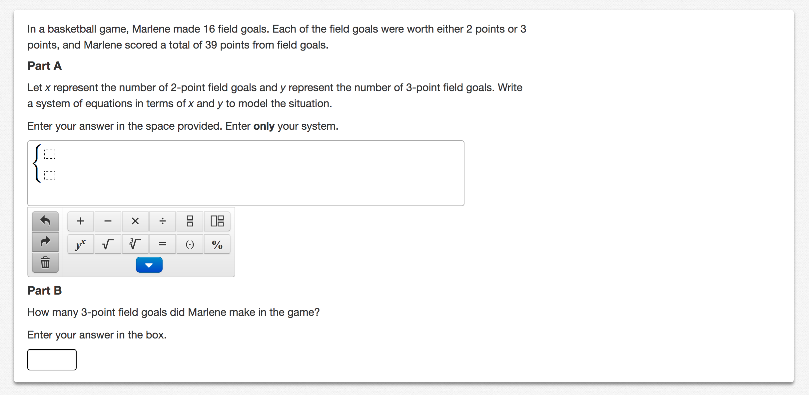
 

 

  Image source: <a href="https://parcc.pearson.com/practice-tests/math/"> 
  https://parcc.pearson.com/practice-tests/math/
  </a> (Algebra I Practice Test)

---

## Possible Multidimensional Model

---

## Multidimensional Model for the Math Item

Multidimensional Item Characteristic Curve

Multidimensional IRT Model

$P\left(Y_{pi} = 1 \middle| \text{ELA}_p, \text{Math}_p \right) = $

$$\frac{\exp\left(\beta_{0,i} + \beta_{ELA,i}\text{ELA}_p  + \beta_{Math,i}\text{Math}_p  + \beta_{Math \times ELA,i} \text{Math}_p  \text{ELA}_p \right)}{1 + \exp\left(\beta_{0,i} + \beta_{ELA,i}\text{ELA}_p  + \beta_{Math,i}\text{Math}_p + htt\beta_{Math \times ELA,i} \text{Math}_p  \text{ELA}_p \right)}$$

--- &twocol

## Standards are Multidimensional

*** {name: left}
- Example: Next Generation Science Standards
 

 
 

*** {name: right}
 

 
 

 

  Image source:   <a href="http://www.p2learninggroup.com/next-generation-science-standards.html"> 
  http://www.p2learninggroup.com/next-generation-science-standards.html
  </a>

---

## Section Summary

>- Sometimes, a single score is not sufficient to characterize student test performance, knowledge, or behavior
>- Next Generation Science Standards have multiple dimensions
>  - Core ideas
>  - Crosscutting concepts
>  - Practices

--- .segue

# Multidimensional Assessment Practices

---

## Most Operational Multidimensional Models

>- Most large-scale summative testing programs are multidimensional...
>  - Multidimensional by a series of unidimensional tests
>- Separate assessment of multiple dimensions
>  - Example: Assessment of ELA separate from Mathematics
>- Even testing programs claiming new multidimensional models estimate each dimension separately
>  - Dynamic Learning Maps
>- Bad pratice: Taking a single dimension and turn it into multiple dimensions
>  - Create single score with all items of an assessment (a unidimensional model)
>  - Then create subscores by taking items from different content domains/strands (implying multiple dimensions)
>  - Subscale scores are necessarily at a finer grain size, but...

---

 

 
 

 

  Image source: <a href="http://doc.renlearn.com/KMNet/R0053249615EE616.pdf"> 
  http://doc.renlearn.com/KMNet/R0053249615EE616.pdf
  </a> (p. 8)

---

## Much Ado about Subscores

Harvesting subscale scores from unidimensional tests is problematic:
>- A uni- and multidimensional model both cannot be correct
>- If the unidimensional model was appropriate for the test:
>  - Subscale scores should see correlations approach 1.0 as the number of items increases
>- If the multidimensional model was appropriate for the test, then the unidimensional overall (total) score would not be valid
>  - Either needs some type of arbitrary method for combining multiple scores (think Body Mass Index: total of height and weight of a person)
>  - Or, if calibrated with a unidimensional model, the score is likely not as reliable as is being reported
>- Subscale scores likely represent error 
>  - Yet they are what are asked for the most by educators
>  - Grain size is information!

--- &nologo

<iframe src = "http://jonathantemplin.com:3838/ccsso2017/subscoreCor/" style="width:100%; height=900px"></iframe>

---

## Section Summary

>- None of the commonly-used current large-scale assessment practices allows multiple traits to be measured by an item
>- Items built for Next Generation Science Standards assessment inherently will measure more than one trait
>  - One core concept
>  - One or more cross-cutting ideas
>  - One or more practices

--- .segue

## Multidimensional Psychometric Models

---

## Multidimensional  Model Familes

# Models That May Work for Assessing Multiple Dimensions

>- Multidimensional IRT Models (MIRT)
>- Diagnostic Classification Models (DCMs)
>- Knowledge Space Theory 
>- Of note: each is part of a larger family of models called Bayesian Inference Networks (BayesNets)
>   - Graphical models &mdash; similar versions used in machine learning and computer science

---

## The Curse of Dimensionality

>- Although a multidimensional model sounds straightforward to apply, there is a catch...
>- In general, as more dimensions are measured by a test, more items are needed to reach a reliable level of measurement for each dimension
>- More items means more time for testing
> - 

 

 

  Image source: <a href="https://en.wikipedia.org/wiki/Curse_of_dimensionality"> 
  https://en.wikipedia.org/wiki/Curse_of_dimensionality
  </a>

--- &nologo

# More Dimensions $\longrightarrow$ More Items

<iframe src="http://jonathantemplin.com:3838/ccsso2017/subscoreRel/" style="width:100%; height=900px"></iframe>

---

## Diagnostic Classification Models

DCMs represent student abilities with ordinal categories instead of scores
>- Why: In short it takes fewer items to classify a person with high reliability than it does to provide a continuous score with a reasonable reliabilty
>- How: Grouping students into homogeneous categories (masters vs. non-masters)
>  - Students within a category are considered to have the same amount of ability
>  - The masters category contains students that have more ability than the non-masters category
>- Goal: To provide multiple "scores" per test with a high reliabilty
>- Goal: To make sure tests are of a reasonable length

<!--TO CONSIDER: ADD IMAGE OF CONTINUUM VS CATEGORIES HERE -->

---

## Names for Diagnostic Classification Model 

DCMs have been called by many names:
- Cognitive diagnosis models
- Skills assessment models
- Cognitive psychometric models
- Latent response models
- Restricted (constrained) latent class models
- Multiple classification models
- Structured located latent class models
- Structured item response theory

--- 

## Score Reliability Comparison

From: Templin and Bradshaw (2013; Journal of Classification)

--- &nologo

# DCM Reliability

<iframe src="http://jonathantemplin.com:3838/ccsso2017/dcmRel/" style="width:100%; height=900px"></iframe>

---

## Note: Other Versions Exist

- The categorization of scores in DCMs brings about the reliability result on the previous slide
  - Any categorization of a continuum will also bring about a similar result
- DCMs attempt to divide a continuum based on features of the data
  - Arbitrary cuts could also be used
- More than two categories can also be used
  - More categories means less overall reliability  

--- 

## Example of DCM Score Report

---

## DCMs in DLM

DCMs are used in the Dynamic Learning Maps Alternate Assessment System: http://dynamiclearningmaps.org/
>   - Assessment consortium for students with significant cognitive disabilities
>   - Based on concept of learning maps
>   - Does not report at the skill level (collections of skills, but only for some states)

---

## Learning Maps

A learning map is:
- A collection of skills to be mastered, along with
- The connections between skills 

The map indicates the skills that must be mastered prior to learning any new skill

---

## Example Portion of the DLM Learning Map

From: http://dynamiclearningmaps.org

---

## DLM Implementation

# The Missing Learning Map

 
Although the learning map idea behind DLM is very important, issues have remained in its implementation:

> - The map itself is not directly used in the scoring process
> - The size of the initial map was far too big to align (some 6,000+ latent variables)
> - The needs of the consortium necessitated two types of tests
>   - Integrated throughout the year
>   - Year end only
> - The population of students necessitates short tests
> - The states involved were unprepared for such a change in test results

---

## Section Summary

>- Assessing multiple dimensions simultaneously is difficult
>- More dimensions necessitates one or more of:
>  - Changes to the score (e.g., from continuous to categorical)
>  - More items on the assessment

 

--- .segue

# "Innovations" in Policy

---

## The Every Student Succeeds Act (ESSA)

The ESSA was signed into law by President Barack Obama on December 10, 2015. 

--- 

## ESSA

Notable portions of the law with respect to accountability:
> - States have flexibility in format of assessment
>   - Can include multiple interim assessments throughout the academic year
> - Ability to pilot innovative approaches to statewide assessments (up to seven states)
>   - Multiple assessments (e.g., curriculum-embedded, interim, or through-course tests) given throughout the year
>   - May be based on a subset of grades/subjects
>   - Up to 8 years to implement statewide
> - The ESSA could be the means to better testing and instruction, but...

---

## A Plot Twist in the ESSA

It remains to be seen how the Trump Administration will handle the ESSA:

> - Recent Edweek Headline: What Happened to ESSA's Innovative Testing Pilot? (By Alyson Klein on August 8, 2017)
> - See: http://blogs.edweek.org/edweek/campaign-k-12/2017/08/essa_innovative_testing_pilot_what_happened_devos_department.html

--- .segue

# Informing Instruction and Accountability

---

## Merging Psychometrics and Policy

What an Innovative Assessment Could Look Like:

- It could be learning map-based or informed, but may not need the "map" portion

--- 

## Multidimensional Standards

- Each square is a latent variable 
  - Mastery status can be attained instead of scale score
  - All that matters: Student has learned material in each square

---

## Modularized Assessment

- Can assess each latent variable throughout school year
- Students who are masters of content can move on
- Students who need remediation can take earlier material

---

## Assessment Throughout Academic Year

- Students are assessed proximal to when content is learned in curriculum
- Later content depends on mastery of earlier content, all progress counts for accountability
- My argument: All tests are summative, only differentiated by grain size of latent variable

---

## Instant Results Needed

Because each test is tied to curriculum, results must be instant:
- If a student is found to be a master: they move on
- If a student is not yet a master: they get remediation

---

## Results Used for Summative Accountability

Goal for students: Master as many concepts as possible
- Profile-based standards can be accomplished
- Standard setting takes a different form
- Students mastering more complex material can show evidence for simpler material

---

## Results Used for Growth

Growth is simple concept: 
- What do you know now that you did not know before?
- Understandable metrics that do not yield notable nonsense results

---

## Overall Benefit

Tests can be integrated into instruction and the curriculum
- No need for "testing windows" and exam preparation
- Teaching to the test means teaching the curriculum

--- .segue

# Concluding Remarks

---

## Concluding Remarks

> - The lag time from research to practice can be long, and for good reason
> - But, testing is so ubitquous (and expensive), that providing more information is necessary to continue
> - The interplay between research, practice, and policy is critical
>   - Research: Development and evaluation of methods and models
>   - Practice: Assessment literacy and use by those who impact education
>   - Policy: Designing laws that enable better and less intrusive assessment systems
> - From Linn (2003, Ed Researcher/AERA Presidential Address): "True accountability means broadly shared responsibility, not only among educators and students, but also administrators, policymakers, parents, and educational researchers."

---

## Thank you!

Questions? Comments? Complaints?

- Email: jtemplin@ku.edu
- Website: https://jonathantemplin.com
- Twitter: <a href="https://twitter.com/DrJTemplin">@DrJTemplin</a>
- Slides available: <a href="https://goo.gl/rfTyiU"> https://goo.gl/rfTyiU</a>

- Built in R with the slidify package: <a href="http://slidify.org/"> http://slidify.org/</a>
- Talk script available: <a href="https://github.com/jonathantemplin/LinnMemorialLecture2017">https://github.com/jonathantemplin/LinnMemorialLecture2017</a>

